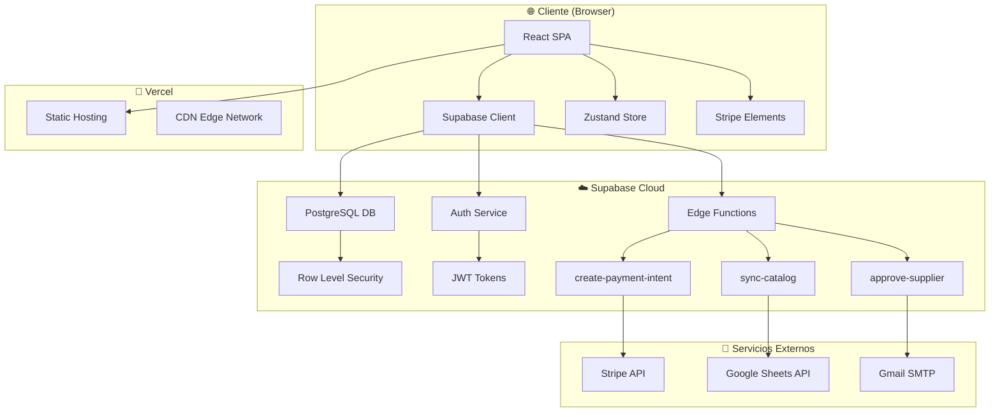
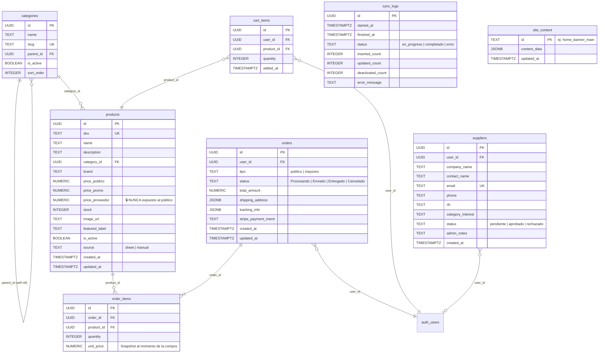
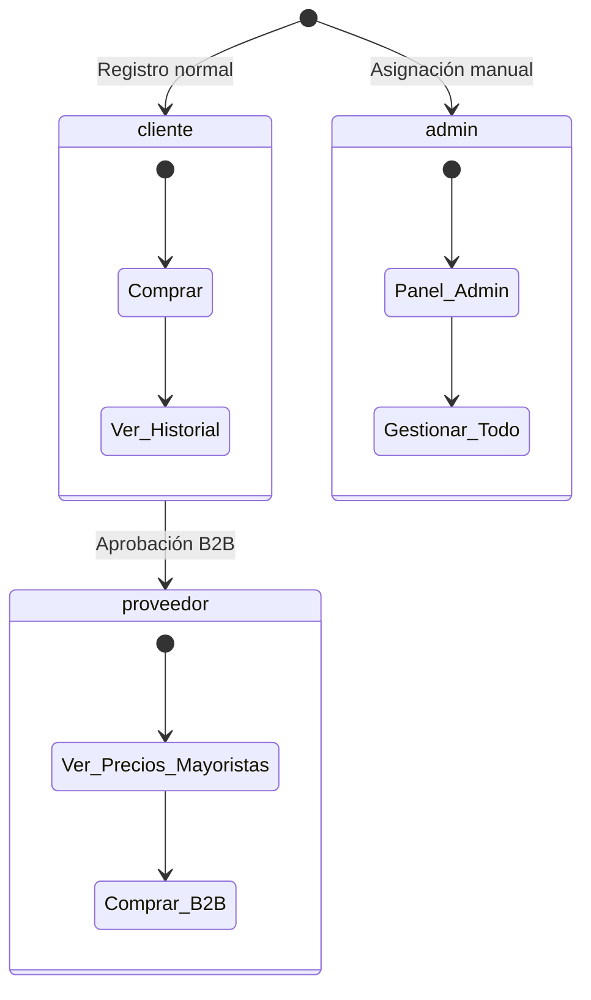
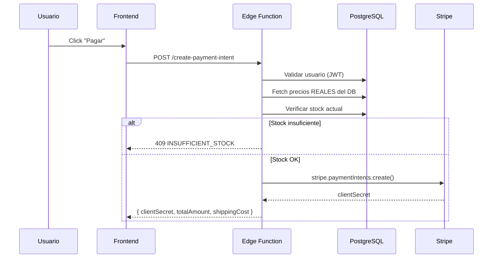
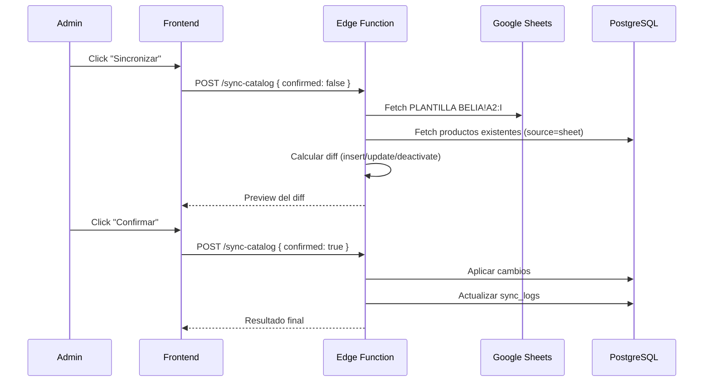
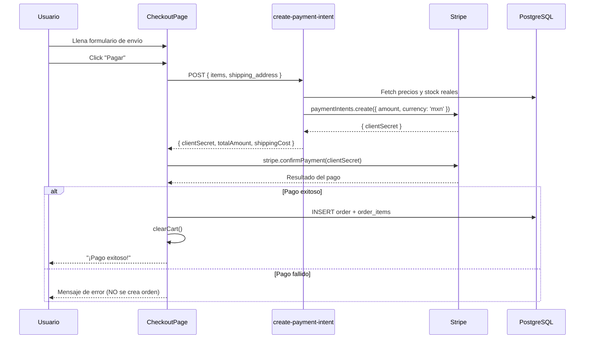
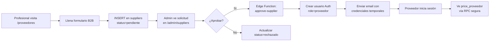
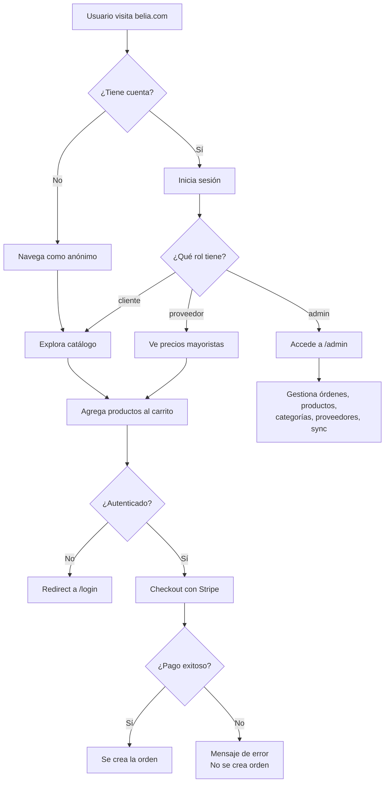

# Belia Premium Beauty — Documentación Completa del Sistema

> **Última actualización:** Octubre 2026  
> **Versión:** 0.0.0 (MVP)  
> **Repositorio:** `github.com/iainnomind-cpu/demo-belia`

---

## Índice

1. [Visión General](#1-visión-general)
2. [Ecosistema Tecnológico](#2-ecosistema-tecnológico)
3. [Arquitectura del Sistema](#3-arquitectura-del-sistema)
4. [Estructura del Proyecto](#4-estructura-del-proyecto)
5. [Base de Datos (Supabase)](#5-base-de-datos-supabase)
6. [Sistema de Autenticación y Roles](#6-sistema-de-autenticación-y-roles)
7. [Edge Functions (Backend Serverless)](#7-edge-functions-backend-serverless)
8. [Frontend — Storefront (Tienda Pública)](#8-frontend--storefront-tienda-pública)
9. [Frontend — Panel de Administración](#9-frontend--panel-de-administración)
10. [Sistema de Diseño (Design Tokens)](#10-sistema-de-diseño-design-tokens)
11. [Estado Global (State Management)](#11-estado-global-state-management)
12. [Hooks Personalizados](#12-hooks-personalizados)
13. [Sistema de Categorías](#13-sistema-de-categorías)
14. [Flujo de Pagos (Stripe)](#14-flujo-de-pagos-stripe)
15. [Sincronización de Catálogo (Google Sheets)](#15-sincronización-de-catálogo-google-sheets)
16. [Flujo B2B (Proveedores/Estilistas)](#16-flujo-b2b-proveedoresestilistas)
17. [Despliegue (Vercel)](#17-despliegue-vercel)
18. [Variables de Entorno](#18-variables-de-entorno)
19. [Seguridad](#19-seguridad)
20. [Diagramas](#20-diagramas)

---

## 1. Visión General

**Belia** es una plataforma e-commerce de productos de belleza profesional diseñada para dos audiencias principales:

| Audiencia | Descripción | Precio que ven |
|---|---|---|
| **Público General** | Personas que compran para uso personal | `price_publico` / `price_promo` |
| **Profesionales (B2B)** | Estilistas, salones de belleza, barbers, manicuristas, lashistas | `price_proveedor` (precio mayorista oculto al público) |

### Características Principales

- 🛒 **E-commerce completo** con carrito, checkout y pagos vía Stripe
- 🔐 **Precios B2B ocultos** — Los precios de proveedor solo se exponen mediante una función RPC segura
- 📊 **Sincronización automática** desde Google Sheets (catálogo existente del cliente)
- 🎨 **Diseño premium** con glassmorphism, animaciones 3D y sistema de tokens personalizado
- 👑 **Panel de administración** completo para gestión de órdenes, productos, categorías, proveedores y contenido
- 📱 **Responsive** — Diseño mobile-first optimizado para todos los dispositivos

---

## 2. Ecosistema Tecnológico

### Stack Principal

```
┌────────────────────────────────────────────────┐
│                   FRONTEND                      │
│  React 19 + TypeScript 6 + Vite 8              │
│  Tailwind CSS 3 + Framer Motion 12             │
│  React Router DOM 7 + Zustand 5                │
└─────────────────────┬──────────────────────────┘
                      │ HTTPS
┌─────────────────────▼──────────────────────────┐
│                   BACKEND                       │
│  Supabase (PostgreSQL + Auth + RLS + Storage)  │
│  Supabase Edge Functions (Deno Runtime)        │
└─────────────────────┬──────────────────────────┘
                      │
┌─────────────────────▼──────────────────────────┐
│              SERVICIOS EXTERNOS                 │
│  Stripe (Pagos MXN)                            │
│  Google Sheets API (Catálogo fuente)           │
│  Gmail SMTP (Emails transaccionales)           │
└────────────────────────────────────────────────┘
```

### Dependencias de Producción

| Paquete | Versión | Propósito |
|---|---|---|
| `react` | ^19.2.6 | Framework UI |
| `react-dom` | ^19.2.6 | Renderizado DOM |
| `react-router-dom` | ^7.18.0 | Enrutamiento SPA |
| `@supabase/supabase-js` | ^2.110.2 | Cliente de base de datos y auth |
| `zustand` | ^5.0.14 | Estado global (carrito) |
| `framer-motion` | ^12.40.0 | Animaciones y transiciones |
| `@stripe/react-stripe-js` | ^6.7.0 | Componentes de pago Stripe |
| `@stripe/stripe-js` | ^9.9.0 | SDK de Stripe |

### Dependencias de Desarrollo

| Paquete | Versión | Propósito |
|---|---|---|
| `vite` | ^8.0.12 | Bundler y dev server |
| `typescript` | ~6.0.2 | Type-checking estricto |
| `tailwindcss` | ^3.4.19 | Utilidades CSS |
| `@tailwindcss/forms` | ^0.5.11 | Plugin para formularios |
| `@tailwindcss/container-queries` | ^0.1.1 | Container queries CSS |
| `eslint` | ^10.3.0 | Linting |
| `postcss` | ^8.5.15 | Procesador CSS |
| `autoprefixer` | ^10.5.0 | Prefijos CSS automáticos |

---

## 3. Arquitectura del Sistema



### Flujo de Datos

1. **Frontend** se comunica con Supabase directamente usando el SDK (`@supabase/supabase-js`)
2. **RLS (Row Level Security)** en PostgreSQL controla qué datos puede leer/escribir cada usuario según su rol
3. **Edge Functions** manejan la lógica de negocio sensible (pagos, sincronización, aprobación de proveedores)
4. **Zustand** gestiona estado efímero del UI (carrito abierto/cerrado, items del carrito)

---

## 4. Estructura del Proyecto

```
belia-app/
├── public/
│   └── logo.png                      # Logo de la marca
├── src/
│   ├── App.tsx                       # Router principal
│   ├── main.tsx                      # Entry point
│   ├── index.css                     # Estilos globales y tokens CSS
│   ├── assets/
│   │   └── hero.png                  # Imagen hero section
│   ├── components/
│   │   ├── auth/
│   │   │   ├── AdminRoute.tsx        # HOC para rutas protegidas (admin)
│   │   │   └── AuthModal.tsx         # Modal de login/registro
│   │   ├── cart/
│   │   │   └── CartSidebar.tsx       # Panel lateral del carrito
│   │   ├── catalog/
│   │   │   ├── ProductCard.tsx       # Tarjeta de producto
│   │   │   └── FiltersSidebar.tsx    # Filtros de búsqueda
│   │   └── layout/
│   │       ├── Header.tsx            # Header con mega-menú y glassmorphism
│   │       ├── MobileMenu.tsx        # Menú hamburguesa móvil
│   │       └── StorefrontLayout.tsx  # Layout wrapper del storefront
│   ├── data/
│   │   └── products.ts              # Datos estáticos de fallback
│   ├── hooks/
│   │   ├── useAuth.ts               # Hook de autenticación
│   │   ├── useCategories.ts         # Hook de categorías (tree builder)
│   │   └── useProducts.ts           # Hook de productos (infinite scroll)
│   ├── lib/
│   │   └── supabase.ts              # Cliente Supabase configurado
│   ├── pages/
│   │   ├── admin/
│   │   │   ├── AdminLayout.tsx       # Layout del panel admin (sidebar)
│   │   │   ├── AdminOrdersPage.tsx   # Gestión de órdenes
│   │   │   ├── AdminCustomersPage.tsx # Gestión de clientes
│   │   │   ├── AdminProductsPage.tsx # CRUD de productos
│   │   │   ├── AdminCategoriesPage.tsx # CRUD de categorías
│   │   │   ├── AdminContentPage.tsx  # Editor de contenido del sitio
│   │   │   ├── AdminSuppliersPage.tsx # Solicitudes de proveedores
│   │   │   └── AdminSyncPage.tsx     # Panel de sincronización
│   │   └── storefront/
│   │       ├── HomePage.tsx          # Página principal (Hero + Categorías + Productos)
│   │       ├── CategoryPage.tsx      # Catálogo por categoría (infinite scroll)
│   │       ├── ProductDetailPage.tsx # Detalle de producto individual
│   │       ├── CheckoutPage.tsx      # Checkout con Stripe
│   │       ├── LoginPage.tsx         # Página de login
│   │       └── SupplierFormPage.tsx  # Formulario B2B de registro
│   ├── store/
│   │   ├── cartStore.ts             # Estado del carrito (Zustand)
│   │   ├── orderStore.ts            # Estado de órdenes
│   │   └── productStore.ts          # Estado de productos
│   └── types/
│       └── database.ts              # Tipos TypeScript del schema completo
├── supabase/
│   ├── migrations/
│   │   ├── 0001_initial_schema.sql   # Schema inicial + RLS + RPC
│   │   └── 0002_seed_categories.sql  # Seed de categorías y subcategorías
│   └── functions/
│       ├── create-payment-intent/    # Edge Function: pagos Stripe
│       ├── sync-catalog/             # Edge Function: sync Google Sheets
│       └── approve-supplier/         # Edge Function: aprobación B2B
├── package.json
├── tailwind.config.js                # Tokens de diseño completos
├── tsconfig.json
├── vite.config.ts
└── postcss.config.js
```

---

## 5. Base de Datos (Supabase)

### Diagrama Entidad-Relación



### Row Level Security (RLS)

> [!CAUTION]
> **TODAS las tablas tienen RLS habilitado desde su creación.** No existe una sola tabla sin protección.

| Tabla | Público (anón) | Cliente autenticado | Proveedor | Admin |
|---|---|---|---|---|
| `categories` | ✅ Leer activas | ✅ Leer activas | ✅ Leer activas | ✅ CRUD completo |
| `products` | ✅ Leer activas (sin `price_proveedor`) | ✅ Leer activas | ✅ Leer activas + RPC `price_proveedor` | ✅ CRUD completo |
| `orders` | ❌ | ✅ Solo sus propias | ✅ Solo sus propias | ✅ Todas |
| `order_items` | ❌ | ✅ Solo de sus órdenes | ✅ Solo de sus órdenes | ✅ Todos |
| `suppliers` | ✅ Solo INSERT | ❌ | ❌ | ✅ CRUD completo |
| `sync_logs` | ❌ | ❌ | ❌ | ✅ CRUD completo |
| `site_content` | ✅ Leer | ✅ Leer | ✅ Leer | ✅ CRUD completo |
| `cart_items` | ❌ | ✅ Solo su propio carrito | ✅ Solo su propio carrito | ✅ N/A |

### Función RPC Segura: `get_supplier_products()`

```sql
-- SECURITY DEFINER: se ejecuta con permisos elevados
-- pero SOLO si el caller tiene role='proveedor' o 'admin'
CREATE FUNCTION get_supplier_products(p_category_id UUID DEFAULT NULL)
RETURNS TABLE (... incluyendo price_proveedor ...)
LANGUAGE plpgsql SECURITY DEFINER
```

Esta función es la **única vía** para acceder a `price_proveedor`. Ni siquiera un SELECT directo sobre la tabla `products` lo retorna al público.

### Triggers

- **`set_updated_at()`** — Se ejecuta automáticamente en `BEFORE UPDATE` sobre `products` y `orders` para mantener `updated_at` actualizado.

---

## 6. Sistema de Autenticación y Roles

### Roles de Usuario



| Rol | Código | Permisos | Cómo se obtiene |
|---|---|---|---|
| **Cliente** | `cliente` | Navegar, comprar, ver historial | Registro automático |
| **Proveedor** | `proveedor` | Todo de cliente + ver `price_proveedor` | Aprobación admin vía Edge Function |
| **Admin** | `admin` | Acceso total al panel de administración | Asignación manual en `user_metadata` |

### Hook `useAuth()`

```typescript
// Retorna:
interface UseAuthReturn {
  user: AuthUser | null;       // { id, email, role }
  session: Session | null;     // Token JWT completo
  loading: boolean;
  signIn(email, password);     // Login con email
  signUp(email, password);     // Registro
  signInWithOAuth(provider);   // Login con Google/Facebook
  signOut();                   // Cerrar sesión
}
```

El rol del usuario se lee de `user_metadata.role` en el JWT de Supabase. Si no tiene rol, se asigna `'cliente'` por defecto.

---

## 7. Edge Functions (Backend Serverless)

Corren en el **Deno Runtime** de Supabase. Todas requieren autenticación JWT.

### 7.1 `create-payment-intent`

**Propósito:** Crea un Payment Intent de Stripe con validación de stock en tiempo real.



**Reglas de negocio:**
- Los precios se recalculan desde la DB (nunca confiamos en lo que envía el frontend)
- Si el usuario es `proveedor`, usa `price_proveedor` vía RPC
- Envío gratis para compras ≥ $1,500 MXN
- Envío por defecto: $150 MXN
- Moneda: MXN

### 7.2 `sync-catalog`

**Propósito:** Sincroniza el catálogo de productos desde un Google Sheet.



**Columnas del Google Sheet (PLANTILLA BELIA):**

| Col | Campo | Ejemplo |
|---|---|---|
| A | SKU | `BEL-001` |
| B | Nombre | `Shampoo Keratina 500ml` |
| C | Marca | `L'Oréal` |
| D | Categoría | `Capilar` |
| E | Precio Público | `299.00` |
| F | Precio Promo | `249.00` |
| G | % Descuento Proveedor | `30` |
| H | Stock | `50` |
| I | Etiqueta Destacado | `TOP 1` |

**Reglas:**
- Solo toca productos con `source='sheet'` — los `source='manual'` nunca se modifican
- SKUs duplicados en el sheet: toma la primera ocurrencia
- Productos que desaparecen del sheet → soft delete (`is_active = false`)
- `price_proveedor` se calcula como: `price_publico × (1 - descuento% / 100)`

### 7.3 `approve-supplier`

**Propósito:** Aprueba una solicitud B2B y crea la cuenta del proveedor.

**Flujo:**
1. Admin aprueba desde el panel
2. Se crea un usuario en Supabase Auth con `role: 'proveedor'`
3. Se genera una contraseña temporal segura
4. Se actualiza el estado del supplier a `'aprobado'`
5. Se envía email de bienvenida con credenciales vía Gmail SMTP
6. Si falla la actualización en DB, se hace rollback del usuario Auth

---

## 8. Frontend — Storefront (Tienda Pública)

### Rutas del Storefront

| Ruta | Componente | Descripción |
|---|---|---|
| `/` | `HomePage` | Hero section + categorías + productos destacados |
| `/categoria/:slug` | `CategoryPage` | Catálogo con filtros e infinite scroll |
| `/producto/:id` | `ProductDetailPage` | Detalle de producto individual |
| `/checkout` | `CheckoutPage` | Formulario de pago (requiere auth) |
| `/proveedores` | `SupplierFormPage` | Formulario de registro B2B |
| `/login` | `LoginPage` | Login con email/password u OAuth |
| `*` | Redirect a `/` | Fallback para rutas no encontradas |

### Layout del Storefront

```
┌──────────────────────────────────────────────┐
│  Header (Glassmorphism, sticky, mega-menú)   │
├──────────────────────────────────────────────┤
│                                              │
│              <Outlet /> (Páginas)             │
│                                              │
├──────────────────────────────────────────────┤
│  CartSidebar (panel lateral derecho)         │
└──────────────────────────────────────────────┘
```

### HomePage — Secciones

1. **Hero Section** — Split layout con imagen de fondo, logo flotante en panel glassmórfico, badge de anuncio, headline, CTAs y trust signals
2. **Quick Categories** — Grid de 6 íconos SVG personalizados con links a categorías principales
3. **Productos Destacados** — Grid animado de productos con `featured_label`
4. **Lo Más Vendido** — Toggle con filtro por "más vendidos"

### CategoryPage — Funcionalidad

- **Infinite Scroll** — Carga de 24 productos por batch (FR-025)
- **Filtros** — Por marca, rango de precio, búsqueda por texto
- **Vistas** — Grid y lista
- **Mega-menú dinámico** — Las categorías se cargan desde la DB, no están hardcodeadas

### Componentes Clave

**`ProductCard`** — Muestra imagen, nombre, marca, precio público, precio promo (tachado), badge de destacado. **NUNCA muestra `price_proveedor`** a menos que se pase explícitamente como prop `supplierPrice`.

**`CartSidebar`** — Panel slide-in desde la derecha con lista de items, controles de cantidad (+/-), subtotal y botón de checkout. Usa Framer Motion para animaciones.

**`Header`** — Header sticky con efecto glassmorphism (`backdrop-blur-xl bg-white/85`), barra de búsqueda, mega-menú de categorías con subcategorías, logo centrado, y acciones de usuario.

---

## 9. Frontend — Panel de Administración

### Acceso

El panel admin está protegido por el componente `AdminRoute` que verifica `user.role === 'admin'`. Si el usuario no es admin, se redirige.

### Rutas Admin

| Ruta | Componente | Funcionalidad |
|---|---|---|
| `/admin` | Redirect → `/admin/orders` | — |
| `/admin/orders` | `AdminOrdersPage` | Tabla de órdenes, cambio de status con progresión |
| `/admin/customers` | `AdminCustomersPage` | Usuarios, total de órdenes, LTV, badge VIP |
| `/admin/products` | `AdminProductsPage` | CRUD productos, toggle `is_active`, etiquetas |
| `/admin/categories` | `AdminCategoriesPage` | CRUD categorías, estructura padre-hijo |
| `/admin/content` | `AdminContentPage` | Editor de banners y contenido del sitio |
| `/admin/suppliers` | `AdminSuppliersPage` | Solicitudes B2B, botones aprobar/rechazar |
| `/admin/sync` | `AdminSyncPage` | Trigger de sincronización, logs de sync |

### Progresión de Status de Órdenes

```
Procesando → Enviado → Entregado
     ↓           ↓
  Cancelado   Cancelado
```

No se puede cancelar una orden ya entregada. No se puede regresar de Entregado.

### VIP Badge

Un cliente recibe badge VIP si su LTV (lifetime value = suma de todas sus órdenes) supera el umbral configurable almacenado en `site_content` (`id='vip_threshold'`). Default: $3,000 MXN.

---

## 10. Sistema de Diseño (Design Tokens)

### Paleta de Colores

| Token | Hex | Uso |
|---|---|---|
| `belia-red` | `#F6423C` | Primario: CTAs, acentos de marca |
| `belia-coral` | `#FB7A76` | Secundario: hovers, degradados suaves |
| `belia-pink` | `#FF8FA3` | Acento rosa |
| `belia-blush` | `#FFF0F3` | Fondo rosa suave para tarjetas |
| `belia-cream` | `#FDF8F5` | Fondo crema base del sitio |
| `belia-charcoal` | `#232323` | Texto principal |
| `belia-gray` | `#9A9A9A` | Texto secundario, bordes |

### Tipografía

- **Font Family:** Plus Jakarta Sans (alternativa a TT Norms sin licencia comercial)
- **Headlines:** `font-extrabold tracking-tight`
- **Hero Display:** `text-4xl sm:text-5xl lg:text-[4rem]`

### Sombras Premium

```css
belia-sm:   0 2px  12px rgba(246, 66, 60, 0.08)
belia-md:   0 8px  32px rgba(246, 66, 60, 0.12)
belia-lg:   0 16px 48px rgba(246, 66, 60, 0.16)
belia-xl:   0 24px 64px rgba(246, 66, 60, 0.20)
card-hover: 0 12px 40px rgba(0, 0, 0, 0.08)
mega-menu:  0 16px 48px rgba(0, 0, 0, 0.10)
```

### Animaciones

| Token | Curva | Duración |
|---|---|---|
| `spring` | `cubic-bezier(0.32, 0.72, 0, 1)` | — |
| `spring-out` | `cubic-bezier(0.22, 0.61, 0.36, 1)` | — |
| `bounce` | `cubic-bezier(0.34, 1.56, 0.64, 1)` | — |
| `fade-up` | ease | 0.5s |
| `scale-in` | spring | 0.35s |
| `slide-down` | spring | 0.25s |

### Espaciado (8-point grid)

```
base:            8px
element-gap:     16px
gutter:          24px
margin:          32px
card-padding:    24px
section-mobile:  48px
section-desktop: 72px
```

---

## 11. Estado Global (State Management)

### Zustand — `useCartStore`

El carrito usa Zustand para estado **efímero y optimista**. La persistencia en DB ocurre separadamente vía `cart_items`.

```typescript
interface CartState {
  items: CartItem[];           // Lista de productos en el carrito
  isCartOpen: boolean;         // Sidebar visible o no
  checkoutSuccess: boolean;    // Flag post-compra exitosa
  addToCart(product, qty, supplierPrice?);
  removeFromCart(productId);
  updateQuantity(productId, delta);  // +1 o -1
  clearCart();
  setIsCartOpen(isOpen);
  setCheckoutSuccess(status);
}
```

**Reglas del carrito:**
- `quantity` nunca puede exceder `stock` del producto
- `quantity` mínima es 1
- `price_proveedor` solo se asigna si el usuario es `proveedor`
- Al agregar un producto que ya existe, se incrementa la cantidad (no se duplica)
- Al agregar al carrito, el sidebar se abre automáticamente

---

## 12. Hooks Personalizados

### `useAuth()`

Gestiona toda la autenticación. Escucha cambios de sesión en tiempo real vía `onAuthStateChange`. Soporta email/password y OAuth (Google, Facebook).

### `useProducts(initialFilters?)`

Fetcha productos activos con **infinite scroll** (batches de 24). Construye queries dinámicos con filtros server-side.

```typescript
// Filtros disponibles:
interface ProductFilters {
  categoryId?: string;
  brand?: string;
  minPrice?: number;
  maxPrice?: number;
  searchQuery?: string;  // Busca en name, brand y SKU
}

// Retorna:
{
  products: Product[];
  loading: boolean;
  loadingMore: boolean;
  hasMore: boolean;
  error: string | null;
  loadMore: () => void;       // Trigger para siguiente batch
  filters: ProductFilters;
  setFilters: (f) => void;    // Resetea y recarga al cambiar
}
```

> [!IMPORTANT]
> `useProducts()` **NUNCA** selecciona `price_proveedor`. Los campos se listan explícitamente en el SELECT para evitar exposición accidental.

### `useCategories()`

Carga las categorías activas y construye un **árbol jerárquico** (padre → hijos).

```typescript
interface CategoryTree extends Category {
  children: Category[];
}

// Retorna:
{
  categories: Category[];      // Lista plana
  categoryTree: CategoryTree[]; // Estructura jerárquica
  loading: boolean;
  error: string | null;
}
```

---

## 13. Sistema de Categorías

### Estructura Jerárquica

Las categorías usan una relación de auto-referencia (`parent_id → categories.id`):

| Categoría Padre | Subcategorías |
|---|---|
| **Capilar** | Shampoos y Tratamientos, Peinado y Estilizado, Accesorios |
| **Coloración** | Tintes, Decolorantes, Peróxidos, Accesorios, Otros |
| **Skincare** | Depilación, Facial, Corporal, Manos y Pies, Accesorios |
| **Maquillaje** | Rostro, Labios, Ojos, Accesorios |
| **Uñas** | Esmaltes, Decoración, Manicure, Pedicure, Accesorios |
| **Profesionales** | Estilistas, Barbers, Lashistas, Manicuristas, Pedicuristas |
| **Men's Care** | Peinado y Estilizado, Barba y Bigote, Skincare, Shampoos y Tratamientos, Accesorios |

Los slugs siguen el patrón `{padre}-{subcategoria}` (ej. `coloracion-tintes`, `skincare-facial`).

---

## 14. Flujo de Pagos (Stripe)



> [!WARNING]
> **Si el pago falla, NO se crea ninguna orden.** Este es un requisito explícito (FR-010) para evitar órdenes huérfanas.

---

## 15. Sincronización de Catálogo (Google Sheets)

### Modo Preview vs Confirmado

La Edge Function soporta **dos modos**:

1. `{ confirmed: false }` — Retorna un preview del diff sin aplicar cambios
2. `{ confirmed: true }` — Aplica los cambios y registra en `sync_logs`

### Protecciones

- **Solo admin** puede ejecutar la sincronización
- **Solo productos `source='sheet'`** son tocados — los manuales nunca se modifican
- **SKUs duplicados** en el sheet se detectan y solo se toma la primera ocurrencia
- **Soft delete** para productos que desaparecen del sheet
- Los errores se registran en `sync_logs` con `status='error'`

---

## 16. Flujo B2B (Proveedores/Estilistas)



### Campos del Formulario B2B

| Campo | Requerido | Descripción |
|---|---|---|
| `company_name` | ✅ | Nombre de la empresa/salón |
| `contact_name` | ✅ | Nombre del contacto |
| `email` | ✅ | Email (se usa como login) |
| `phone` | ❌ | Teléfono de contacto |
| `rfc` | ❌ | RFC fiscal (México) |
| `category_interest` | ❌ | Categorías de interés |

---

## 17. Despliegue (Vercel)

### Build Process

```bash
npm run build
# Ejecuta: tsc -b && vite build
```

1. `tsc -b` — Type-checking estricto (debe pasar con 0 errores)
2. `vite build` — Bundling y optimización

### Configuración TypeScript Estricta

El proyecto usa `verbatimModuleSyntax: true`, lo que requiere:
```typescript
// ✅ Correcto
import { motion, type Variants } from 'framer-motion';

// ❌ Error en build
import { motion, Variants } from 'framer-motion';
```

### Plataforma

- **Hosting:** Vercel (Static SPA)
- **CDN:** Vercel Edge Network
- **Branch de deploy:** `main`
- **Auto-deploy:** Sí, en cada push a `main`

---

## 18. Variables de Entorno

### Frontend (prefijo `VITE_`)

| Variable | Descripción |
|---|---|
| `VITE_SUPABASE_URL` | URL del proyecto Supabase |
| `VITE_SUPABASE_ANON_KEY` | Clave anónima de Supabase (pública, protegida por RLS) |

### Edge Functions (Supabase Secrets)

| Variable | Descripción |
|---|---|
| `SUPABASE_URL` | URL del proyecto (inyectada automáticamente) |
| `SUPABASE_SERVICE_ROLE_KEY` | Clave de servicio con permisos elevados |
| `STRIPE_SECRET_KEY` | Clave secreta de Stripe |
| `GOOGLE_SHEETS_API_KEY` | API Key de Google Sheets |
| `GOOGLE_SHEET_ID` | ID del spreadsheet del catálogo |
| `GMAIL_USER` | Email de Gmail para notificaciones |
| `GMAIL_APP_PASSWORD` | App Password de Gmail (no la contraseña normal) |

> [!CAUTION]
> Las variables de Edge Functions **NO** llevan prefijo `VITE_`. Nunca deben estar expuestas al frontend.

---

## 19. Seguridad

### Principios Implementados

1. **RLS en todas las tablas** — No hay tablas sin Row Level Security
2. **price_proveedor aislado** — Solo accesible vía RPC `get_supplier_products()` con verificación de rol
3. **Validación server-side de precios** — El Edge Function recalcula totales desde la DB
4. **Stock Race Condition Protection** — El Edge Function verifica stock en tiempo real antes de crear el Payment Intent
5. **CORS configurado** en Edge Functions
6. **No hay `any` en TypeScript** — Tipado estricto en todo el frontend
7. **Soft deletes** — Los productos nunca se eliminan físicamente, solo se desactivan
8. **Contraseñas temporales seguras** — Generadas con `crypto.randomUUID()`
9. **Rollback en fallos** — Si falla la actualización del supplier, se elimina el usuario Auth creado

### Flujo de Seguridad del Pago

```
Frontend envía items → Edge Function ignora precios del frontend →
Consulta precios REALES del DB → Calcula total server-side →
Crea Payment Intent con el total real → Retorna clientSecret
```

---

## 20. Diagramas

### Flujo Completo del Usuario



---

> [!NOTE]
> Este documento refleja el estado actual del sistema MVP. Las siguientes funcionalidades están planeadas pero no implementadas:
> - Integración real con envía.com para costos de envío dinámicos
> - Notificaciones push de cambio de status de orden
> - Sistema de reseñas de productos
> - Programa de lealtad/puntos
